# Cloud Run Deployment via Cloud Build
## Project Description  
This project demonstrates a **CI/CD pipeline** where application code is automatically built into a **Docker image** and deployed to **Google Kubernetes Engine (GKE)**.  
The pipeline ensures that every code change pushed to GitHub is tested, containerized, and deployed to a GKE cluster with zero manual intervention.  

It also includes optimizations such as:  
- ✅ Automated Docker builds  
- ✅ GKE deployment with Kubernetes manifests  
- ✅ Configurable environment variables  
- ✅ Resource tuning & Ingress management  
- ✅ Error handling, logging, and health checks 
---


## Project Description

This project demonstrates a CI/CD pipeline where application code is automatically built into a Docker image and deployed to Google Cloud Run using Google Cloud Build.  
### The pipeline ensures:
- Automated build and deployment
- Scalability (up to 10 instances)
- Configurable CPU & Memory for Cloud Run service
- Public accessibility (--allow-unauthenticated)


## 🏗️ Architecture  

```mermaid
graph TD;
    Dev[👨‍💻 Developer] -->|Push Code| GitHub[🐙 GitHub Repo]
    GitHub -->|Trigger| Actions[⚡ GitHub Actions CI/CD]
    Actions -->|Build & Push| Artifact[📦 Artifact Registry]
    Actions -->|Deploy| GKE[GKE Cluster]
    GKE -->|Ingress| User[🌍 End Users]
```


---


## Architecture

Cloud Build picks up changes → builds Docker image → pushes to Artifact Registry → deploys to Cloud Run.

## Setup Instructions
### Prerequisites
- A Google Cloud Project with billing enabled
- Cloud Run API and Cloud Build API enabled
- Installed gcloud CLI
```bash
gcloud services enable run.googleapis.com cloudbuild.googleapis.com artifactregistry.googleapis.com
```
### Configure Environment Variables
Before running the pipeline, set the following substitutions:
```yaml
substitutions:
  _DEPLOYMENT_NAME: my-service
  _IMAGE: us-central1-docker.pkg.dev/PROJECT_ID/REPO_NAME/IMAGE_NAME:tag
  _REGION: us-central1
```

### Build & Deploy via Cloud Build
Submit the build with:
```bash
gcloud builds submit --config cloudbuild.yaml .
```
- This will:
- Build Docker image
- Push image to Artifact Registry
- Deploy service to Cloud Run

### Verify Deployment
Get the service URL:
```bash
gcloud run services describe my-service --region us-central1 --format="value(status.url)"
```
Open the URL in a browser

## Cloud Build Config Explanation (`cloudbuild.yaml`)
```yaml
- name: 'gcr.io/google.com/cloudsdktool/cloud-sdk'
  id: Deploy to Cloud Run
  args:
    - 'gcloud'
    - 'run'
    - 'deploy'
    - '${_DEPLOYMENT_NAME}'
    - '--image'
    - '${_IMAGE}'
    - '--region'
    - '${_REGION}'
    - '--platform'
    - 'managed'
    - '--allow-unauthenticated'
    - '--port=8080'
    - '--cpu=2'
    - '--memory=4Gi'
    - '--max-instances=10'
  timeout: 600s
```
### Key Points:
- id: Label for the step (helps debugging & readability)
- --port=8080: Ensures app listens correctly
- --cpu / --memory: Allocates resources
- --max-instances: Controls scaling
- timeout: Gives deployment more time (600s = 10 min)

### Outcome
After setup, any code push will:
- Trigger Cloud Build
- Build Docker image
- Deploy updated service to Cloud Run
- Make app available at a public URL
